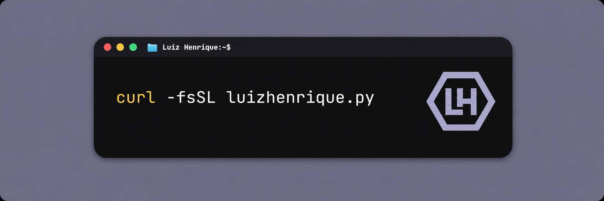

<br/>

<div align="center">


<br/>
 


</div>

---

## Sobre mim

Sou desenvolvedor **Backend**, com foco em **Python, APIs e integrações entre sistemas**.

Trabalho para construir aplicações confiáveis e fáceis de manter, lidando com regras de negócio, consumo de APIs externas, autenticação, persistência e sincronização de dados.

Ao mesmo tempo, estou fortalecendo minha base em **Docker, Linux, Shell, redes, CI/CD, Cloud, segurança, observabilidade e monitoramento**. Meu objetivo é entender todo o ciclo de uma aplicação — da construção à entrega, execução e operação — e evoluir no caminho de **DevOps, DevSecOps e SRE**, sem perder uma base forte em Backend.

---

## Backend

<div align="center">


</div>

- Python, FastAPI e Flask
- Desenvolvimento e consumo de APIs REST
- Integrações entre sistemas e serviços externos
- OAuth 2.0, JWT e API Keys
- Webhooks, processamento e sincronização de dados
- PostgreSQL, SQL e modelagem relacional
- Testes, tratamento de erros e documentação de APIs

---

## Engenharia, infraestrutura e operação

<div align="center">


</div>

Atualmente, venho aprofundando meus estudos e projetos em:

- Docker e Docker Compose
- Linux, Shell e administração de serviços
- Git, GitHub e CI/CD
- Redes, Nginx e proxy reverso
- Cloud e fundamentos de infraestrutura
- Logs, métricas, health checks e monitoramento
- Observabilidade, segurança e práticas de DevSecOps
- Fundamentos de confiabilidade e SRE

---

## Projetos em destaque

### 🛒 [Abandono de Carrinho](https://github.com/luizaopy/abandono-de-carrinho)

API REST em **Python e Flask** para detecção e recuperação de carrinhos abandonados, com regras de negócio separadas por camadas, SQLAlchemy, agendamento de tarefas, validação, testes e envio de e-mails.

`Python` `Flask` `SQLAlchemy` `REST API` `Pytest`

### 💰 [Custo Tiny](https://github.com/luizaopy/custo_tiny)

Aplicação integrada ao **Tiny ERP** para processamento de NF-e, cálculo de custos e sincronização com PostgreSQL, preparada para execução com Docker Compose.

`Python` `PostgreSQL` `Docker` `API Integration` `SQLAlchemy`

### 📡 [Upscope](https://github.com/luizaopy/upscope)

Projeto open source voltado ao **monitoramento de APIs e serviços**, com health checks, métricas, alertas e observabilidade.

`Monitoring` `APIs` `Observability` `DevOps`

---

## Direção profissional

```text
Backend forte
├── Python, APIs e integrações
├── Bancos de dados e arquitetura
└── Testes, segurança e confiabilidade

Engenharia e operação
├── Docker, Linux e Shell
├── Redes, CI/CD e Cloud
└── Observabilidade, DevSecOps e SRE
```

Estou construindo uma base sólida para me tornar um profissional capaz de **desenvolver, entregar, proteger, monitorar e operar aplicações com qualidade**.

---

## Atividade no GitHub

<div align="center">


<br/>


</div>


